# **Kotlin Compose Multiplatform - School App**

The main objective is to create a customizable and intuitive application, allowing to integrate several essential tools and services in the same space. The application meets various educational needs by offering key features such as a forum system, file sharing, an interactive calendar, a syllabus purchase page, grade management and an enriched user profile. It emphasizes customization and ergonomics to offer an optimal user experience.

## **Application**

Here are some screenshots of the application: 

  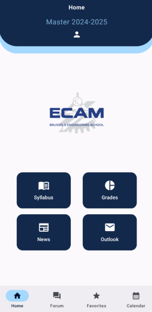
  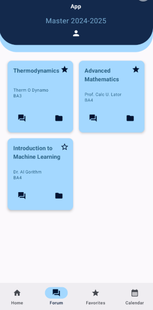
  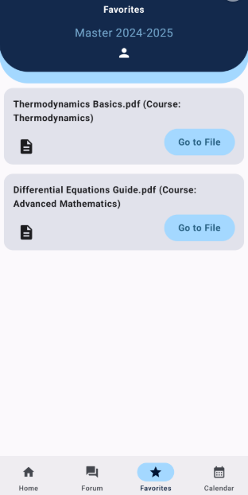
  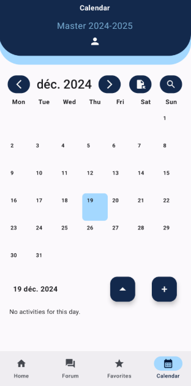
  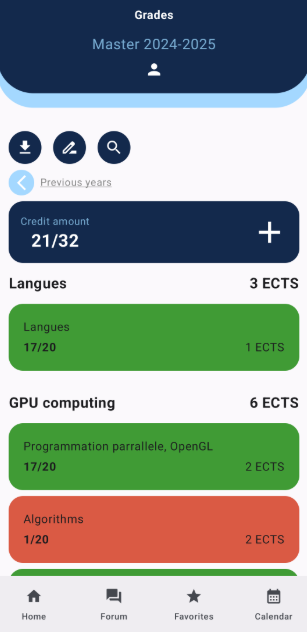
  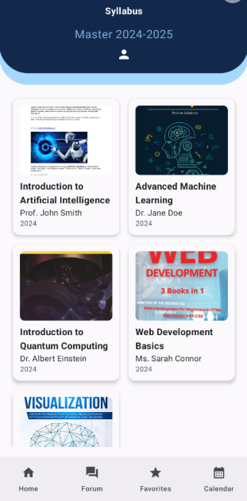
  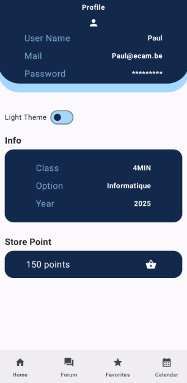
  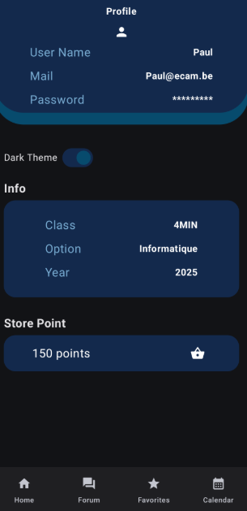
  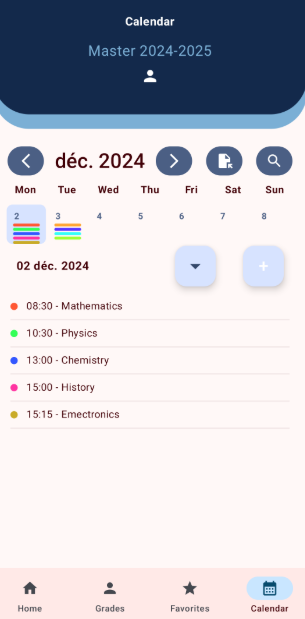
  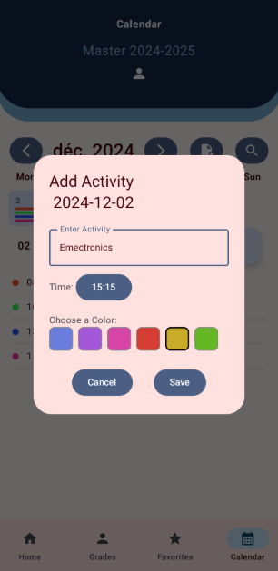
  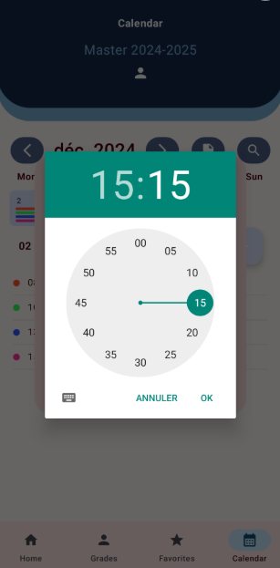

## **Key Features**

### 1. Common UI

- Using a uniform color theme throughout the application to maintain visual consistency and a strong identity.
- Ability to customize the theme according to user preferences, including light and **dark modes** to improve visual comfort.
- Simple and minimalist interface, easy for users to navigate.
- Smooth design with use of Jetpack Compose components.

  

### 2. Home Page

- **Syllabus**: Easily browse available courses.
- **Student Help Forum**: Provide a support and assistance space for students.
- **File Sharing**: Feature facilitating file hosting and sharing.
- **Messaging**: Access messaging compatible with platforms like Outlook for simplified communication.

### 3. Forum & File Sharing System

- Integration of an online JSON database to save and load files as well as messages.
- Upload functionality allowing users to easily share files such as course summaries, notes, or presentations.
- An interactive forum for exchanging information, asking questions, and collaborating with other users.
- Favorites feature to quickly access important forum or file-sharing pages.

### 4. Calendar Page

- Detailed display of academic periods and key events.
- Intuitive navigation within months and easy selection of specific days to view or organize activities.
- Add and delete activities for personalized schedule management.
- Quick search to find specific activities or navigate easily to important sections.

### 6. Syllabus Page

- Clear display of a list of syllabi available for courses and academic subjects.
- View detailed information about a course or syllabus in a few clicks.
- Smooth and intuitive navigation between the list of syllabi and detailed course pages.
- Integration of a purchase feature allowing users to acquire a syllabus or manual directly within the app.

### 7. Grades Page

- Option to download transcripts for offline viewing.
- Quick and intuitive exam registration via the app.
- Grade visualization with detailed information about earned credits and GPA.
- Display of pass or fail status for a summarized view of academic performance.

### 8. Profile and Shop

- Display user information such as class, option, and current year.
- Toggle between light and dark modes via a toggle button.
- Show cumulative points earned in the app and allow spending them in the shop.
- List of items available for purchase to customize the user experience or access additional tools.

---

## Architecture

- This project follows the **MVVM (Model-View-ViewModel)**  architecture to ensure a clear separation.
- Makes it easier to maintain and evolve the code.

### Dependencies

#### Common Dependencies
- **Compose Runtime**
- **Compose Foundation**
- **Compose Material**
- **Compose Material3**: `1.2.1`
- **Compose UI**
- **Compose Tooling**
  - Preview: `1.7.2`
  - Debugging: `1.7.2`
- **Material Kolor**: `2.0.0`

#### Android-Specific Dependencies
- **AndroidX Activity Compose**: `1.9.2`
- **AndroidX Lifecycle ViewModel**: `2.8.2`
- **AndroidX Lifecycle Runtime Compose**: `2.8.2`
- **Navigation Compose**: `2.8.0-alpha10`
- **Material Icons Extended**: `1.7.5`
- **OkHttp**: `4.11.0`
- **Retrofit**:
  - Core: `2.9.0`
  - Gson Converter: `2.9.0`
- **Coil for Compose**: `2.4.0`
- **PDF Viewer**: `3.2.0-beta.3`

#### Multiplatform Dependencies
- **Koin Core**: `4.0.0`
- **Koin Android**: `4.0.0`
- **Koin Compose ViewModel**: `4.0.0`
- **Ktor**:
  - Core: `2.3.12`
  - OkHttp: `2.3.12`
  - Content Negotiation: `2.3.12`
  - JSON Serialization: `2.3.12`
- **Network DateTime Picker**: `1.0.6`
- **Kamel (Image Loading)**: `0.9.5`
- **Kotlinx Coroutines**: 
  - Core: `1.6.4`
  - Android: `1.7.3`

#### Build Plugins
- **Kotlin Multiplatform Plugin**: `2.0.20`
- **Compose Multiplatform Plugin**: `1.6.11`
- **Android Application Plugin**: `8.7.2`
- **Kotlin Serialization Plugin**: `2.0.20`

---

## Prerequisites

- **JDK**: 11 or higher
- **Device or Emulator**: Android 6.0 (API 23) or higher

----

## **Setup**

This is a Kotlin Multiplatform project targeting Android, iOS, Web.

* `/composeApp` is for code that will be shared across your Compose Multiplatform applications.
  It contains several subfolders:
  - `commonMain` is for code that’s common for all targets.
  - Other folders are for Kotlin code that will be compiled for only the platform indicated in the folder name.
    For example, if you want to use Apple’s CoreCrypto for the iOS part of your Kotlin app,
    `iosMain` would be the right folder for such calls.

* `/iosApp` contains iOS applications. Even if you’re sharing your UI with Compose Multiplatform,
  you need this entry point for your iOS app. This is also where you should add SwiftUI code for your project.

Learn more about [Kotlin Multiplatform](https://www.jetbrains.com/help/kotlin-multiplatform-dev/get-started.html),
[Compose Multiplatform](https://github.com/JetBrains/compose-multiplatform/#compose-multiplatform),
[Kotlin/Wasm](https://kotl.in/wasm/)…

We would appreciate your feedback on Compose/Web and Kotlin/Wasm in the public Slack channel [#compose-web](https://slack-chats.kotlinlang.org/c/compose-web).
If you face any issues, please report them on [GitHub](https://github.com/JetBrains/compose-multiplatform/issues).

You can open the web application by running the `:composeApp:wasmJsBrowserDevelopmentRun` Gradle task.

---------

## **Possible Fixes**
Here is a list of issues identified in the project, with suggestions for improvements:

1. **Not optimally targeting Android**

- Which could limit its effectiveness on other target platforms like iOS and Web.
- Solution: Check the balance between Android-specific modules and shared modules in commonMain.

2. **Issues in the build.gradle file**

- Incorrect or incomplete declarations that could lead to compilation or runtime errors.
- Solution: Review the build.gradle configurations to fix errors and optimize dependency management.
- Bad separation between Android and Coil

- The Coil integration is not properly separated in the Android part, which causes dependency inconsistencies and logic errors.
Confusion between androidMain and commonMain

- A bad implementation of CoroutineScope could lead to memory leaks.

